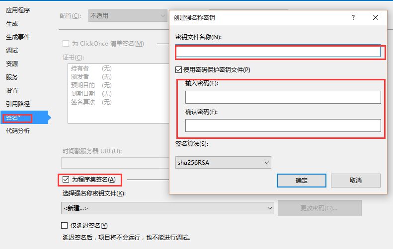

#程序集

一个程序集是包含.NET Framework可执行代码的一个基本的逻辑单元，  而且是一个完整的自描述的逻辑单元，但并不是一个物理单元，因为一个程序集可以包含多个存储文件，如果一个程序集包含多个存储文件，那么一定会包含一个manifest文件，这个manifest文件包含了程序的主入口和其他文件的引用信息。

无论是可执行的代码还是类库代码，都是相同的程序结构，唯一的区别就是可执行的代码程序包含一个全局入口，我们说了，程序集的一个重要特性就是包含元数据和自描述的功能，自描述中包含了对于方法和类型的描述，而这个描述文件被命名为manifest文件，同时，这个文件还包含了程序集的版本和完整性信息。

应用程序集包含了程序的元数据信息就意味着调用这个应用程序集不再需要注册表或者其他数据源提供相应的信息，这个进步很大，以前的数据要么包含在COM里，要么包含在注册表里或者包含在类型库里，这些对于数据同步读取非常不方便，有了程序集，就没有读取这些数据的风险，因为程序集里的元数据存储程序指令集里，即使程序集包含多个文件，程序集的入口文件也包含了其他程序集文件的详细信息，哈希值和内容描述，所以就算其他文件被人为替换入口文件也不会识别替换的文件。

程序集包含了私有程序集和共享程序集：

###私有程序集

所谓的私有程序集，你知道，就是你的代码里面不引用任何的其他GAC类库（当然，这是不可能的），私有程序集出问题的可能性很小，因为通常私有程序集会随着你的代码部署到相应文件夹，或者文件夹的子文件夹，这样不会有注册表的影响，不会有其他问题，所以你只需要关心程序集的命名空间即可，有一些软件的程序集可能被其他程序集覆盖，但是也没有关系。

###共享程序集

共享程序集是一个所有程序都可以引用的程序集，你也知道，所有程序都可以引用就会出现以下两个风险：
1. 命名重复
2. 版本问题

如果程序集的命名或者版本不同，就会出现覆盖问题，于是.NET引入了全局程序集缓存（GAC），GAC是一个常用类库的我文件系统，这个文件系统和常见的文件系统不同，不能拷贝程序集到指定文件夹，程序集只能通过.NET提供的工具类安装到缓存文件夹里，下面位置C:\Windows\assembly是GAC在windows操作系统中的位置，从这个文件夹中我们可以看出，GAC并不是一个文件，其实是一个层次结构，用来确保不同版本的程序集都可以将完整的结构信息保存下来。

为了确保不会出现命名冲突，GAC中每个程序集都有一个唯一的名称，这个名称是私钥加密的key，使用这个私钥key能够保证命名问题，这种方式叫做强签名，在vs里面，每个项目都可以注册到GAC

