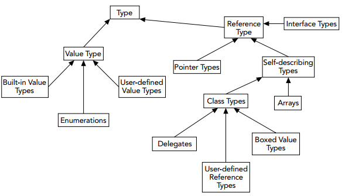

#IL

提到IL，我们知道这是.NET Framework的核心，IL语言有如下特性：

1. 面向对象和接口
2. 值类型和引用类型的区分（装箱和拆箱）
3. 强数据类型
4. Exception错误处理
5. Attributes

##支持面向对象和接口
.NET面向对象的语言实现需要有一定的限制条件，IL需要实现特定的编程条件，架构在IL上面的语言也需要遵守这些
条件，微软选择了经典的面向对象的编程方式，兼容接口类型。

面向对象中IL引入的接口概念是在COM组件编程中为我们熟知的，但.NET内置的接口又与COM接口不太一样，.NET接口
不需要支持COM架构，不需要继承IUnkonwn接口，他们共享一个定义契约的语法原则，使用class继承并实现此原则，从而支持了C#中的多态等语法特性，.NET中继承自接口的类必须完全实现接口中定义的方法。

##值类型和引用类型

众所周知的，值类型在内存中的栈区，引用类型在内存中的堆区。

##强数据类型

IL架构在强数据类型基础上，所以每个变量在定义时必须定义出其类型，IL禁止产生模糊数据类型。VB6中数据类型支持自动转换，C++通过指针的方式进行数据转换，虽然定义强数据类型会有一定的性能上的损失，但其提供的便利之处远大于其性能损失（现在不都是提倡用空间换时间么）

* 语言互操作
* 垃圾回收
* 数据安全
* 应用程序域

### 强数据类型是语言互操作的关键

试想一下，如果我们用vb定义了一个方法，返回vb中的integer类型，现在我们用C#来调用这个方法，我们如何知道vb中这个方法返回值呢？我们又该如何使用呢？ IL中的强数据类型解决了这个问题

*通用类型系统CTS*

通用类型系统CTS很简单，就是在IL中预定义强数据类型，所有编译为IL的语言都需要有类型的映射，所以vb中的integer映射为IL中的Int32，C#中的int类型映射为Int32。

CTS定义了类型的层次结构，这个层次结构如下：

*通用语言规范CLS*

通用语言规范CLS和通用类型系统共同确保了语言的互操作性，CLS定义了一系列的标准，所有需要编译为IL的语言都需要遵守这些标准 然后举了个我没懂的区分大小写的例子...

1. 编译器不必要实现所有的CLS功能，只需要实现CLS的子集。
2. 实现CLS的编译器能够在.NET平台上编译通过并且被其他语言调用。

限制你的是使用public和protected定义的class和method，因为使用private定义的代码外部代码不能够调用到，所以你在private中可以充分利用语言特性为所欲为。

*垃圾回收*

.NET中垃圾回收是自动处理的，实现自动处理的垃圾回收有两种方式：

1. 在代码中显示指明释放内存
2. 内存中的[引用计数器](https://en.wikipedia.org/wiki/Reference_counting)保持对对象的引用

乍听起来，觉得可能不太理解，代码中显示指明释放内存这种事情对于.NET的开发人员来说不太常见，通常在引用一个第三方组件的时候使用，例如对于Office文档的操作类，继承IDispose接口，引用计数器则是指内存中的一个维持对象、数组的一个指针数组，动态检测此对象在运行过程中是否还会继续使用，如果不继续使用，则释放此对象，so... 过多的时候静态类型可能导致内存的膨胀。

很多时候，类似于C++这种手动释放内存的语言在性能上有很大的优势，但同时又要求你非常牛逼，如果没有释放内存，很容易造成内存泄漏。虽然现在的开发者有很多工具能够检测内存泄漏情况，但这些检测条件是内存泄漏已经发生才能够检测，这时候你的宿主机必然已经卡出翔。

COM一直使用引用计数器，但是COM使用的方式更加具有风险，内存的释放取决于引用计数器是否已经清空，如果还有数值，就不能清空，而调用了引用计数器的客户端在释放的时候还必须通知引用计数器已经取消，如果有一台客户端没有清空，比如一个应用程序调用了COM，而这个应用程序一直驻留在内存中，很可能导致内存泄漏。

所谓天下文章一大抄，就看你会抄不会抄，.NET的垃圾回收和Java非常类似，使用同样的原理，所有动态请求的内存都在堆上，当然，CLR有自己的托管堆，这个我们不用管，我们只要知道当应用程序进程已经达到需要检测的临界标准，.NET会调用垃圾回收器，垃圾回收器检测堆中的对象引用在代码以后的定义执行过程中是否还会用到，其实如果需要用到的话，一定保留着对这个对象的引用，如果没有，就移除此对象，释放内存。

